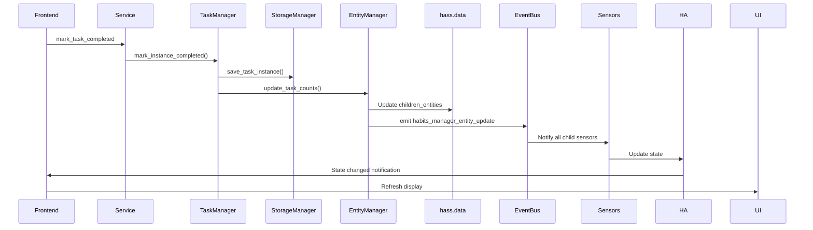
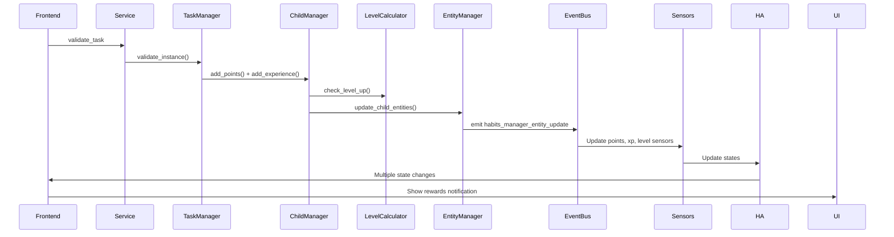
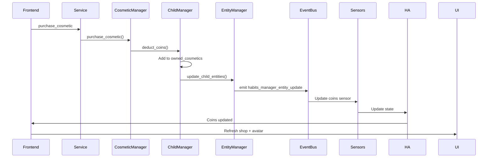

# Events System - Habits Manager

Ce document décrit le système d'événements utilisé par l'intégration pour la communication entre composants.

## Vue d'ensemble

Habits Manager utilise le bus d'événements de Home Assistant pour:
- Mettre à jour les sensors en temps réel
- Notifier le frontend des changements
- Déclencher des automations

---

## Événements émis

### `habits_manager_entity_update`

Émis quand les données d'un enfant sont modifiées.

**Data:**
```yaml
child_id: "child_abc123"
```

**Émis par:**
- `EntityManager.update_child_entities()`
- `EntityManager.update_task_counts()`
- `EntityManager.update_longest_streak()`

**Déclenché quand:**
- Enfant mis à jour (nom, points, coins, level, XP)
- Tâche complétée/validée/refusée
- Habitude complétée
- Récompense réclamée/approuvée
- Cosmétique acheté

**Listeners:**
- Tous les sensors de cet enfant (`BaseChildSensor`)
- Frontend (si abonné via WebSocket)

**Exemple d'utilisation dans sensor:**
```python
async def async_added_to_hass(self):
    @callback
    def handle_entity_update(event):
        if event.data.get("child_id") == self._child_id:
            self.async_schedule_update_ha_state(True)
    
    self.async_listen(
        f"{DOMAIN}_entity_update",
        handle_entity_update
    )
```

**Exemple d'automation:**
```yaml
trigger:
  - platform: event
    event_type: habits_manager_entity_update
    event_data:
      child_id: "child_abc123"
action:
  - service: notify.mobile_app
    data:
      message: "Données de Sophie mises à jour!"
```

---

### `habits_manager_entity_delete`

Émis quand un enfant est supprimé.

**Data:**
```yaml
child_id: "child_abc123"
```

**Émis par:**
- `EntityManager.delete_child_entities()`

**Déclenché quand:**
- Service `delete_child` est appelé

**Effet:**
- Tous les sensors de cet enfant sont supprimés
- Les données sont effacées de `hass.data`

**Exemple d'automation:**
```yaml
trigger:
  - platform: event
    event_type: habits_manager_entity_delete
    event_data:
      child_id: "child_abc123"
action:
  - service: persistent_notification.create
    data:
      title: "Enfant supprimé"
      message: "L'enfant {{ trigger.event.data.child_id }} a été supprimé"
```

---

## Événements Home Assistant utilisés

### `homeassistant_start`

Utilisé pour initialiser l'intégration au démarrage.

**Listener dans `__init__.py`:**
```python
hass.bus.async_listen_once(
    EVENT_HOMEASSISTANT_START,
    async def on_start(event):
        # Initialisation...
)
```

### `time_changed`

Utilisé par le Scheduler pour déclencher des actions à intervalles réguliers.

**Exemple - Génération des tâches à minuit:**
```python
async def schedule_daily_tasks(hass):
    @callback
    def check_time(event):
        now = dt_util.now()
        if now.hour == 0 and now.minute == 0:
            # Générer les task instances
    
    hass.bus.async_listen(
        EVENT_TIME_CHANGED,
        check_time
    )
```

---

## Communication Frontend ↔ Backend

### Méthode 1: Polling sensors

Le frontend lit régulièrement l'état des sensors.

**Avantage:** Simple, pas de config supplémentaire
**Inconvénient:** Latence, pas de temps réel

### Méthode 2: WebSocket avec `response_variable`

Services avec retour immédiat de données.

**Exemple:**
```typescript
await this.hass.callService(
  "habits_manager",
  "list_children",
  {},
  { return_response: true }
);
```

**Retourne les données immédiatement** sans passer par les sensors.

### Méthode 3: Subscription aux sensors

Le frontend s'abonne aux changements de sensors via Home Assistant.

**Exemple:**
```typescript
this.hass.connection.subscribeEvents(
  (event) => {
    console.log("Sensor updated:", event);
    this._loadData();
  },
  "state_changed",
  { entity_id: `sensor.habits_child_${this.childId}_points` }
);
```

---

## Flux d'événements typiques

### Scénario 1: Enfant complète une tâche



### Scénario 2: Parent valide une tâche



### Scénario 3: Enfant achète un cosmétique



---

## Écouter les événements (Debug)

### Via l'UI de Home Assistant

1. Allez dans **Outils de développement > Événements**
2. Tapez `habits_manager_entity_update` dans "Écouter les événements"
3. Cliquez sur "Commencer à écouter"
4. Effectuez une action (compléter une tâche, etc.)
5. Vous verrez l'événement apparaître en temps réel

### Via Python (pour tests)

```python
from homeassistant.core import HomeAssistant, callback

@callback
def handle_update(event):
    print(f"Event received: {event.data}")

hass.bus.async_listen("habits_manager_entity_update", handle_update)
```

### Via les logs

Activez le logging pour voir tous les événements:

```yaml
# configuration.yaml
logger:
  default: info
  logs:
    custom_components.habits_manager: debug
```

Vous verrez dans les logs:
```
DEBUG (MainThread) [custom_components.habits_manager.storage.entity_manager] Updated entity data for child child_abc123
DEBUG (MainThread) [custom_components.habits_manager.storage.entity_manager] Emitting habits_manager_entity_update event
```

---

## Bonnes pratiques

### 1. Émettre des événements de manière cohérente

✅ **Bon:**
```python
# Toujours émettre après une modification
self.hass.data[DOMAIN]["children_entities"][child_id]["points"] = new_points
self.hass.bus.fire(f"{DOMAIN}_entity_update", {"child_id": child_id})
```

❌ **Mauvais:**
```python
# Oublier d'émettre l'événement
self.hass.data[DOMAIN]["children_entities"][child_id]["points"] = new_points
# Les sensors ne se mettront jamais à jour!
```

### 2. Filtrer les événements côté listener

✅ **Bon:**
```python
@callback
def handle_update(event):
    if event.data.get("child_id") == self._child_id:
        self.async_schedule_update_ha_state(True)
```

❌ **Mauvais:**
```python
@callback
def handle_update(event):
    # Se met à jour pour tous les enfants!
    self.async_schedule_update_ha_state(True)
```

### 3. Utiliser `@callback` pour les handlers

✅ **Bon:**
```python
from homeassistant.core import callback

@callback
def handle_update(event):
    # Code synchrone rapide
```

❌ **Mauvais:**
```python
async def handle_update(event):
    # async inutile si pas d'await
```

### 4. Se désabonner proprement

✅ **Bon:**
```python
async def async_added_to_hass(self):
    self._unsub = self.hass.bus.async_listen(...)

async def async_will_remove_from_hass(self):
    if self._unsub:
        self._unsub()
```

---

## Performance

### Fréquence des événements

Les événements sont émis:
- **Souvent:** Quand enfant complète des tâches/habitudes (plusieurs fois par jour)
- **Rarement:** Quand parent configure (créer/modifier tâches, récompenses)

### Optimisation

1. **Batch updates:** Grouper plusieurs modifications
   ```python
   # ✅ Bon: 1 événement pour plusieurs modifications
   entity_data["points"] = new_points
   entity_data["coins"] = new_coins
   entity_data["level"] = new_level
   self.hass.bus.fire(f"{DOMAIN}_entity_update", {"child_id": child_id})
   ```

2. **Async operations:** Utiliser `async_fire` pour événements non-bloquants
   ```python
   self.hass.bus.async_fire(f"{DOMAIN}_entity_update", data)
   ```

3. **Filtrage intelligent:** Éviter les mises à jour inutiles
   ```python
   if old_value != new_value:
       self.hass.bus.fire(...)
   ```

---

## Dépannage

### Les sensors ne se mettent pas à jour

1. **Vérifier que l'événement est émis:**
   ```bash
   ha core logs | grep "Emitting.*entity_update"
   ```

2. **Vérifier que le sensor écoute:**
   ```bash
   ha core logs | grep "handle_entity_update"
   ```

3. **Écouter l'événement manuellement:**
   DevTools > Événements > `habits_manager_entity_update`

### Les événements sont émis trop souvent

1. **Vérifier les conditions:**
   Assurez-vous de ne pas émettre en boucle

2. **Ajouter du throttling:**
   ```python
   from homeassistant.helpers.event import async_call_later
   
   @callback
   def debounced_update():
       self.hass.bus.fire(...)
   
   async_call_later(self.hass, 1, debounced_update)
   ```

---

## Voir aussi

- [API_REFERENCE.md](./API_REFERENCE.md) - Services qui émettent des événements
- [SENSORS.md](./SENSORS.md) - Sensors qui écoutent les événements
- [STRUCTURE.md](./STRUCTURE.md) - Architecture du système
